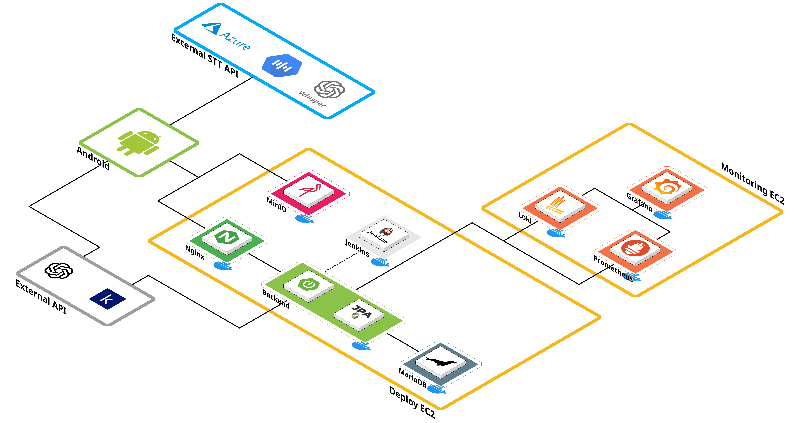

# 내 손 안의 AI 발표 코치, Spico 📱

 

## 📅 프로젝트 정보

### ✨SSAFY 12기 2학기 자율 프로젝트✨

📆 **2025.04.14(월) ~ 2025.05.22(목) [6주]**

**[😎 영상 포트폴리오 바로가기](https://www.youtube.com/watch?v=kVqDxbPYqXk)**

## 📖 주제

## 📝 주요 기능

### 🗂️ 발표 프로젝트 관리	

발표 주제, 시간, 대본 등을 관리, 대본 등 프로젝트 수정 기능

### 🎙️ 코칭 모드	
실시간 발화 기반 실시간 피드백 제공 – 성량, 속도, 휴지 등

### 🧑‍⚖️ 파이널 모드	
실전 발표 시뮬레이션 + AI 자동 Q&A 생성 + 발표 리포트 생성

### 🎲 랜덤스피치 모드	
즉흥 발표 훈련을 위한 랜덤 질문 제공 및 타이머 기능

### 📊 리포트	
모드에 따른 다양한 리포트 제공 - 코칭 피드밷, 점수 시각화, AI 피드백 등

#### 코칭모드 리포트
<table>
  <tr>
    <td colspan="2" align="center"><strong>코칭모드 리포트</strong></td>
  </tr>
  <tr>
    <td></td>
    <td></td>
  </tr>
</table>

#### 파이널모드 리포트
<table>
  <tr>
    <td colspan="2" align="center"><strong>파이널모드 리포트</strong></td>
  </tr>
  <tr>
    <td></td>
    <td></td>
  </tr>
</table>

#### 랜덤스피치 리포트

<table>
  <tr>
    <td colspan="2" align="center"><strong>랜덤스피치 리포트</strong></td>
  </tr>
  <tr>
    <td></td>
    <td></td>
  </tr>
</table>

## 📌 ERD (Entity-Relationship Diagram)

 

## 🪄 Architecture

 

## ⚒️ 기술 스택

### 🖥️ Backend

| Tech Stack | Description                                                                                                                                                                                                                                                                                                                                                                           |
| :--------- | :------------------------------------------------------------------------------------------------------------------------------------------------------------------------------------------------------------------------------------------------------------------------------------------------------------------------------------------------------------------------------------ |
| Framework  |                                                                                                                                                                                                                                                      |
| JDK        |                                                                                                                                                                                                                                                  |
| Build Tool |                                                                                                                                                                                                                                           |
| Database   |                                                                                                                                          |
| Libraries  |    |
| Web Server |                                                                                                                                                                                                                                                                 |
| IDE        |                                                                                                                                                                                                                                                      |

 

### 🖥️ Android

| Tech Stack       | Description                                                                                                                               |
| :--------------- | :---------------------------------------------------------------------------------------------------------------------------------------- |
| Framework        |                      |
| Language         |               |
| Build Tool       |                        |
| State Management |                     |
| Libraries        |       |

 

### 🖥️ DevOps / Deployment

| Tech Stack     | Description                                                                                                                                                                    |
| :------------- | :----------------------------------------------------------------------------------------------------------------------------------------------------------------------------- |
| Container      |                                                      |
| Server         |                             |
| Deployment URL |  |

 

### 🖥️ Common

|                 |                                                                                                                                                                                                                                                                                                                                                         |
| :-------------- | :------------------------------------------------------------------------------------------------------------------------------------------------------------------------------------------------------------------------------------------------------------------------------------------------------------------------------------------------------ |
| Collaboration   |    |
| Version Control |                                                                                                                                                 |

 

## 🧑🏻 팀원

<table>
    <tr>
      <th scope="col" colspan="3"> Android </th>
      <th scope="col" colspan="2"> Backend </th>
      <th scope="col" colspan="1"> Infra </th>
    </tr>
    <tr>
      <td>강명주</td>
      <td>김서현</td>
      <td>신유영</td>
      <td>김예진</td>
      <td>노영단</td>
      <td>이승연</td>
    </tr>
    <tr>
      <td>
        
      </td>
      <td>
        
      </td>
      <td>
          
      </td>
      <td>
        
      </td>
      <td>
        
      </td>
      <td>
        
      </td>
    </tr>
</table>

 

<!-- ## 📚 산출물

|                |                                                   |
| :------------: | ------------------------------------------------: |
| File Structure |  | -->
