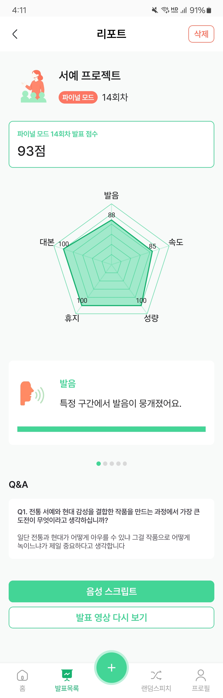

# 내 손 안의 AI 발표 코치 애플리케이션, Spico📱

 

## 📅 프로젝트 정보

### ✨SSAFY 12기 2학기 자율 프로젝트✨

📆 **2025.04.14(월) ~ 2025.05.22(목) [6주]**

**[😎 영상 포트폴리오 바로가기](https://www.youtube.com/watch?v=kVqDxbPYqXk)**

## 📖 주제

“**발표가 무섭다고요?**”

Spico는 발표가 두려운 사람들을 위한 AI 발표 연습 코치 앱입니다.

학교 발표, 면접 등 다양한 상황에서 말하기는 필수가 되었지만, 혼자 연습하긴 어렵고 민망한 발표.  
Spico는 누구나 혼자서도 발표 실력을 키울 수 있도록, 실시간 피드백과 청중 모드와 같은 실전 연습 환경을 제공합니다.

혼자서도 실전처럼, 재미있게, 그리고 스마트하게 연습하세요.

 

<table>
  <tr>
    <td></td>
    <td></td>
  </tr>
</table>

## 📝 주요 기능

### 🗂️ 발표 프로젝트 관리	
발표 주제, 시간, 대본 등을 관리, 대본 등 프로젝트 수정 기능

> 프로젝트 단위로 대본, 발표날짜, 발표시간 등을 구조화하여 프로젝트 확인과 수정이 쉬워집니다.

 

<table>
  <tr>
    <td colspan="1" align="center"><strong>프로젝트 목록</strong></td>
    <td colspan="1" align="center"><strong>대본 수정</strong></td>
  </tr>
  <tr>
    <td></td>
    <td></td>
  </tr>
</table>

### 🎙️ 코칭 모드	
실시간 발화 기반 실시간 피드백 제공 – 성량, 속도, 휴지 등

> Spico는 **발화 즉시 시각 피드백**을 제공합니다.  
> Jetpack Compose 기반 애니메이션과 실시간 음성 분석을 활용하여 성량, 속도, 멈춤 구간을 실시간으로 시각화함으로써 사용자가 즉시 개선 포인트를 인지하고 수정할 수 있도록 돕습니다.

 

<table>
  <tr>
    <td colspan="1" align="center"><strong>실시간 피드백</strong></td>
    <td colspan="1" align="center"><strong>대본 추적</strong></td>
  </tr>
  <tr>
    <td></td>
    <td></td>
  </tr>
</table>

### 🧑‍⚖️ 파이널 모드	
실전 발표 시뮬레이션 + AI 자동 Q&A 생성 + 발표 리포트 생성

> 발표 후 GPT-4o를 이용해 예상 질문을 자동 생성하고, AI 청중이 질문하며 사용자와 인터랙션을 유도합니다.  
> 발표 영상은 자동 저장되며, 리포트를 통해 성과를 구체적으로 분석할 수 있어 실전 발표 대비에 유용합니다.

 

<table>
  <tr>
    <td colspan="1" align="center"><strong>파이널모드 설정</strong></td>
    <td colspan="1" align="center"><strong>파이널모드 Q&A</strong></td>
  </tr>
  <tr>
    <td></td>
    <td></td>
  </tr>
</table>

### 🎲 랜덤스피치 모드	
즉흥 발표 훈련을 위한 랜덤 질문 제공 및 타이머 기능

> 사용자가 선택한 주제(정치·경제·문화 등)를 기반으로 **AI가 최신 뉴스 기사에서 핵심 내용을 추출**한 뒤, 이를 바탕으로 **시의성 있는 랜덤 질문을 생성**합니다.  
> 사용자는 준비 시간과 발화 시간을 설정해 실제 발표처럼 연습할 수 있으며, **스트레스 없이 반복 가능한 즉흥 발표 훈련**이 가능합니다.

 

<table>
  <tr>
    <td colspan="1" align="center"><strong>랜덤스피치 설정</strong></td>
    <td colspan="1" align="center"><strong>랜덤스피치</strong></td>
  </tr>
  <tr>
    <td></td>
    <td></td>
  </tr>
</table>

### 📊 리포트	
모드에 따른 다양한 리포트 제공 - 코칭 피드백, 점수 시각화, AI 피드백 등

#### 코칭모드 리포트

> - 연습 도중 분석된 **성량, 발화 속도, 휴지 횟수**를 시각화하여 사용자에게 즉각적인 개선 포인트를 제공

<table>
  <tr>
    <td colspan="2" align="center"><strong>코칭모드 리포트</strong></td>
  </tr>
  <tr>
    <td></td>
    <td></td>
  </tr>
</table>

#### 파이널모드 리포트

> - **성량, 속도, 대본 일치도, 발음 정확도, 휴지 시간**을 점수화한 **오각형 그래프**  
> - **총점 및 세부 점수 분석**  
> - **Q&A 자동 생성 및 사용자의 응답 기록**  
> - **발표 영상 다시보기 및 음성 STT 스크립트 확인**  

 

<table>
  <tr>
    <td colspan="2" align="center"><strong>파이널모드 리포트</strong></td>
  </tr>
  <tr>
    <td></td>
    <td></td>
  </tr>
</table>

#### 랜덤스피치 리포트

> - 발표 후 제공되는 **AI 피드백 요약**  
> - 사용 질문에 대한 **연관 뉴스·기사 원문 보기 기능**  
> - 실제 발표 음성을 바탕으로 한 **STT 스크립트 제공**  

<table>
  <tr>
    <td colspan="2" align="center"><strong>랜덤스피치 리포트</strong></td>
  </tr>
  <tr>
    <td></td>
    <td></td>
  </tr>
</table>

## 📌 ERD (Entity-Relationship Diagram)

 

## 🪄 Architecture

 

## ⚒️ 기술 스택

### 🖥️ Backend

| Tech Stack | Description                                                                                                                                                                                                                                                                                                                                                                           |
| :--------- | :------------------------------------------------------------------------------------------------------------------------------------------------------------------------------------------------------------------------------------------------------------------------------------------------------------------------------------------------------------------------------------ |
| Language  |                                                                                                                                                                                                                                                       |
| Framework  |                                                                                                                                                                                                                                                      |
| JDK        |                                                                                                                                                                                                                                                  |
| Build Tool |                                                                                                                                                                                                                                           |
| Database   | 
| Libraries  |     |                                   
| IDE        |                                                                                                                                                                                                                                                      |

 

### 🖥️ Android

| Tech Stack       | Description                                                                                                                               |
| :--------------- | :---------------------------------------------------------------------------------------------------------------------------------------- |
| Framework        |                      |
| Runtime        |                      |
| Language         |               |
| IDE        |        

 

### 🖥️ DevOps / Deployment

| Tech Stack     | Description                                                                                                                                                                    |
| :------------- | :----------------------------------------------------------------------------------------------------------------------------------------------------------------------------- |
| Deploy      |                                                       |
| Server         |                             |
| Monitoring     |                                                       |

 

### 🖥️ Common

|                 |                                                                                                                                                                                                                                                                                                                                                         |
| :-------------- | :------------------------------------------------------------------------------------------------------------------------------------------------------------------------------------------------------------------------------------------------------------------------------------------------------------------------------------------------------ |
| Collaboration   |    |
| Version Control |                                                                                                                                                 |

 

## 🧑🏻 팀원

<table>
    <tr>
      <th scope="col" colspan="2"> Backend </th>
      <th scope="col" colspan="1"> Infra </th>
      <th scope="col" colspan="3"> Android </th>
    </tr>
    <tr>
      <td>노영단</td>
      <td>김예진</td>
      <td>이승연</td>
      <td>강명주</td>
      <td>김서현</td>
      <td>신유영</td>
    </tr>
    <tr>
      <td>
        
      </td>
      <td>
        
      </td>
      <td>
        
      </td>
      <td>
        
      </td>
      <td>
        
      </td>
      <td>
          
      </td>
    </tr>
</table>

 

| Contributors | Role                   | Position |
|--------------|------------------------|----------|
| **노영단**     | 팀장,   Backend   | - **Google STT**   - **AI  질문생성**   - **실시간 피드백 생성**   - **파이널 모드 및 코칭모드 백엔드 구현**   - **DB 설계**   - **API 설계**|
| **김예진**   | 팀원,   Backend   | - **STT**   - **랜덤스피치 기능 구현**   - **Android 개발 환경 구축**   - **DB 설계**   - **API 설계**|
| **이승연**   | 팀원,   Infra   | - **배포**   - **모니터링 구축**   - **카카오 로그인**   - **DB 설계**   - **API 설계**|
| **강명주**   | 팀원,   Android  | - **랜덤스피치 구현**   - **홈화면 및 연습 생성 구현**   - **로그인 여부에 따른 접근 권한 제어/네비게이션 조건 처리**  - **와이어프레임**   - **UI/UX 디자인** |
| **김서현**   | 팀원,   Android  | - **코칭모드 구현**   - **프로젝트 생성 및 대본 수정 구현**   - **프로필 구현**   - **와이어프레임**   - **UI/UX 디자인** |
| **신유영**   | 팀원,   Android  | - **파이널모드 구현**   - **프로젝트 목록 구현**   - **FAB 기반 바텀시트 네비게이션 구현**   - **와이어프레임**   - **UI/UX 디자인** |
